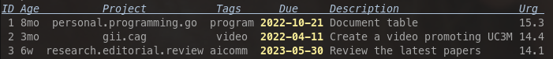
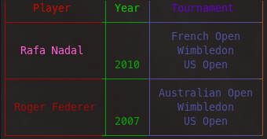

# Introduction

This package implements means for drawing data in tabular form and it is
intended as a substitution of the Go standard package `tabwriter`. Its design is
based on the functionality of tables in LaTeX but extends its functionality in
various ways through a very simple interface

It honours [UTF-8 characters](https://www.utf8-chartable.de/), [ANSI color escape sequences](https://stackoverflow.com/questions/4842424/list-of-ansi-color-escape-sequences), full/partial
horizontal rules, various vertical and horizontal alignment options, and
multicolumns.

Remarkably, it prints any *stringer* and as tables are stringers, tables can be
nested to any degree.


# Installation 

Clone and install the `table` package with the following command:

    $ go get github.com/clinaresl/table
    
To try the different examples given in the package change dir to
`$GOPATH/github.com/clinaresl/table` and type:

    $ go test
   
# Usage #

This section provides various examples of usage with the hope of providing a
flavour of the different capabilities of the package. For a full description of
the package check out the technical documentation.

## First step: Create a table ##

Before inserting data to a new table it is necessary to create it first:

```Go
	t, err := NewTable("l   p{25}")
	if err != nil {
		log.Fatalln(" NewTable: Fatal error!")
	}
```

This snippet creates a table with two columns. The first one displays its
contents ragged left, whereas the second one takes a fixed width of 25
characters to display the contents of each cell and, in case a cell exceeds the
available width, its contents are shown left ragged in as many lines as needed.
In case it was not possible to successfully process the *column specification*,
an error is immediately returned.

The following table shows all the different options for specifying the format of
a single column:

| Syntax | Purpose |
|:------:|:-------:|
|  `l`   | the contents of the column are ragged left |
|  `c`   | the contents of the column are horizontally aligned |
|  `r`   | the contents of the column are ragged right |
|  `p{NUMBER}` | the cell takes a fixed with equal to *NUMBER* characters and the contents are split across various lines if needed |
|  `L{NUMBER}` | the width of the column does not exceed *NUMBER* characters and the contents are ragged left |
|  `C{NUMBER}` | the width of the column does not exceed *NUMBER* characters and the contents are centered |
|  `R{NUMBER}` | the width of the column does not exceed *NUMBER* characters and the contents are ragged right |

The *column specification* allows the usage of `|`, e.g.:

``` Go
	t, _ := NewTable("|c|c|c|c|c|")
```

creates a table with five different columns all separated by a single vertical
separator. It is possible to create also *double* and *thick* vertical
separators using `||` and `|||` respectively. As a matter of fact, these are
just shortcuts and the UTF-8 characters `│`, `║` and `┃` can be used
respectively. It is also possible to provide any other character (e.g., blank
spaces) either before or after any column. These are then copied either before
or after the contents of each cell in each row.

In case a second string is given to `NewTable` it is interpreted as the *row
specification*:

```Go
	t, _ := NewTable("| c | c  c |", "cct")
```

This line (where no error checking is performed!) creates three different
columns whose contents are horizontally centered surrounded by a single space
and with vertical single separators between adjacent columns and before and
after the first and last column. In addition, it sets the *vertical alignment*
of each cell as follows: the contents of the first and second columns are
vertically centered (`c`), whereas the contents of the last column are pushed to
the top of the cell ---`t`. The modifiers available to be used in the *row
specification* are shown next:

| Syntax | Purpose |
|:------:|:-------:|
|  `t`   | the contents of the column are aligned to the top |
|  `c`   | the contents of the column are vertically aligned |
|  `b`   | the contents of the column are aligned to the bottom |

By default, all columns are vertically aligned to the top. In case a *row
specification* is given it must refer to as many columns as there are in the
*column specification* given first or less. In contraposition to the *column
specification*, the *row specification* can only consist of any of the modifiers
shown above.
   
`NewTable` returns a pointer to `Table` which can be used next for adding data
to it and, in the end, printing it.

## Second step: Adding rows ##

`table` acknowledges two different types of rows either horizontal rules or
lines of data.

### Adding horizontal rules ###

There are three different services for adding horizontal rules anywhere in a
table:

```Go
   func (t *Table) AddSingleRule(cols ...int) error
   func (t *Table) AddDoubleRule(cols ...int) error
   func (t *Table) AddThickRule(cols ...int) error
```

When invoked with no arguments they just show a full horizontal rule spanning
over all columns of the table. Single rules are shown with the UTF-8 character
`─`; double rules are drawn using `═`, and thick rules use `━`.

If they are invoked with arguments, then these are taken in pairs, each pair
standing for a *starting* and *ending* column numbered from 0, so that
horizontal rules are drawn only over those columns in the given range.

In case it is not possible to process the given arguments then an informative
error is returned.

A couple of examples follow:

``` Go
    t, _ := NewTable("|c|c|c|c|c|")
    t.AddThickRule ()
    t.AddSingleRule(0, 1, 2, 3, 4, 5)
```

### Adding data ###

Data is added to the bottom of a table with:

``` Go
    func (t *Table) AddRow(cells ...interface{}) error
```

It accepts an arbitrary number of arguments satisfying the null interface and
adds the result of the `Sprintf` operation of each argument to each cell of the
last row of the table. If the number of arguments is strictly less than the
number of columns given in the *column specification* then the remaining cells
are left empty. Thus, if no argument is provided, an empty line of data is
generated. However, if the number of arguments given is strictly larger than the
number of columns of the table an error is returned. 

The following example adds data to a table with three columns: 

``` Go
	t, err := NewTable("| c || c ||| c |")
	err = t.AddRow("Year\n1979", "Year\n2013", "Year\n2018")
	if err != nil {
		log.Fatalln(" AddRow: Fatal error!")
	}
	err = t.AddRow("Ariane", "Gaia\nProba Series\nSwarm", "Aeolus\nBepicolombo\nMetop Series")
	if err != nil {
		log.Fatalln(" AddRow: Fatal error!")
	}
```

Note that the contents of any cell can contain any newline characters `\n`. If
so, the text is split in as many lines as needed, i.e., `table` supports
multi-line cells.

## Third step: Printing tables ##

The last step consists of printing the contents of any table. By definition,
tables are stringers and thus, all that is required is just to print the
contents with a `Print`-like function:

``` Go
	t, _ := NewTable("l | r ")
	t.AddThickRule()
	t.AddRow("Country", "Population")
	t.AddSingleRule()
	t.AddRow("China", "1,394,015,977")
	t.AddRow("India", "1,326,093,247")
	t.AddRow("United States", "329,877,505")
	t.AddRow("Indonesia", "267,026,366")
	t.AddRow("Pakistan", "233,500,636")
	t.AddRow("Nigeria", "214,028,302")
	t.AddThickRule()
	fmt.Printf("%v", t)
```

Which produces the result shown next (all examples are shown as images to avoid
your browser to show unrealistic renderings as a result of your preferences):


# Gotchas #

Beyond the basic usage of tables, `table` provides many other features which are
described next

## ANSI color codes ##

Of course, `table` fully supports UTF-8 encoded characters, but it also manages
[ANSI color escape
sequences](https://stackoverflow.com/questions/4842424/list-of-ansi-color-escape-sequences)
provided that they are supported by your terminal. 

There are several Go packages that can actually produce the additional
characters required to show the output in various forms, but this implementation
is not tied to any, so that the following examples explicitly show the specific
ANSI color codes required to render each fragment:

``` Go
	t, _ := NewTable("l | r \033[0m")
	t.AddThickRule()
	t.AddRow("\033[38;2;206;10;0mCountry\033[0m", "\033[38;2;206;10;0mPopulation")
	t.AddSingleRule()
	t.AddRow("\033[48;2;20;20;160mChina", "1,394,015,977")
	t.AddRow("\033[48;2;20;80;20mIndia", "1,326,093,247")
	t.AddRow("\033[48;2;20;20;160mUnited States", "329,877,505")
	t.AddRow("\033[48;2;20;80;20mIndonesia", "267,026,366")
	t.AddRow("\033[48;2;20;20;160mPakistan", "233,500,636")
	t.AddRow("\033[48;2;20;80;20mNigeria", "214,028,302")
	t.AddThickRule()
	fmt.Printf("%v", t)
```

which produces:



Mind the trick! The ANSI color codes of each line including the headers is
automatically ended with `\033[0m` just simply by adding it to the *column
specification* of the table. Of course, one could end each line manually but as
the example shows this is not necessary at all.

Just by reversing the location of the codes it is also possible to colour only
the splitters and rules:

``` Go
    t, _ := NewTable("\033[38;2;80;80;80ml | r \033[0m")
	t.AddThickRule()
	t.AddRow("\033[0mCountry\033[38;2;80;80;80m", "\033[0mPopulation")
	t.AddSingleRule()
	t.AddRow("\033[0mChina\033[38;2;80;80;80m", "\033[0m1,394,015,977")
	t.AddRow("\033[0mIndia\033[38;2;80;80;80m", "\033[0m1,326,093,247")
	t.AddRow("\033[0mUnited States\033[38;2;80;80;80m", "\033[0m329,877,505")
	t.AddRow("\033[0mIndonesia\033[38;2;80;80;80m", "\033[0m267,026,366")
	t.AddRow("\033[0mPakistan\033[38;2;80;80;80m", "\033[0m233,500,636")
	t.AddRow("\033[0mNigeria\033[38;2;80;80;80m", "\033[0m214,028,302")
	t.AddThickRule()
	fmt.Printf("%v", t)
```

for producing:



# License #

table is free software: you can redistribute it and/or modify it
under the terms of the GNU General Public License as published by the
Free Software Foundation, either version 3 of the License, or (at your
option) any later version.

table is distributed in the hope that it will be useful, but WITHOUT
ANY WARRANTY; without even the implied warranty of MERCHANTABILITY or
FITNESS FOR A PARTICULAR PURPOSE.  See the GNU General Public License
for more details.

You should have received a copy of the GNU General Public License
along with table.  If not, see <http://www.gnu.org/licenses/>.


# Author #

Carlos Linares Lopez <carlos.linares@uc3m.es>  
Computer Science Department <https://www.inf.uc3m.es/en>  
Universidad Carlos III de Madrid <https://www.uc3m.es/home>
